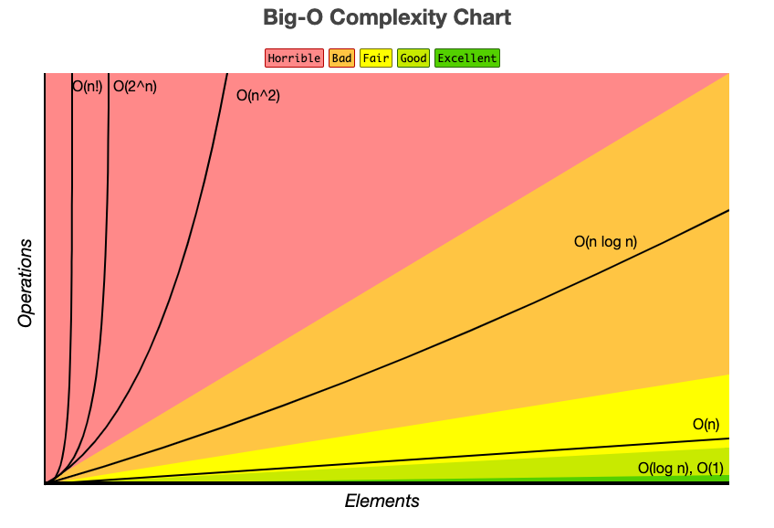

# Big O Cheatsheet

## Big Os

- `O(1)` Constant - no loops
- `O(log N)` Logarithmic - usually searching algorithms have log n if they are sorted (e.g., Binary Search)
- `O(n)` Linear - for loops, while loops through n items
- `O(n log(n))` Log Linear - usually sorting operations (e.g., Merge Sort, Quick Sort)
- `O(n^2)` Quadratic - every element in a collection needs to be compared to every other element. Typically involves two nested loops
- `O(2^n)` Exponential - recursive algorithms that solve a problem of size N (e.g., Fibonacci sequence)
- `O(n!)` Factorial - you are adding a loop for every element (e.g., permutations)

Iterating through half a collection is still `O(n)`.
Two separate collections: `O(a + b)`

## What can cause time in a function?

- Operations (+, -, *, /)
- Comparisons (<, >, ==)
- Looping (for, while)
- Outside function calls (function())

## Rule Book

- Rule 1: Always consider the worst case
- Rule 2: Remove constants
- Rule 3: Different inputs should have different variables. `O(a + b)`. A and B arrays nested would be `O(a * b)`
  - For steps in order, add their complexities
  - For nested steps, multiply their complexities
- Rule 4: Drop non-dominant terms

## Chart

## What causes Space complexity?

- Variables
- Data Structures
- Function Calls
- Allocations

---

## Resources

- <https://www.bigocheatsheet.com/>
